# Domain Name System
{: .no_toc }

How the Internet Resolves 5 Billion Queries Per Second
{: .fs-5 .fw-300 }




---

## Table of contents
{: .no_toc .text-delta }
1. TOC
{:toc}

---

## Why I Started Thinking About This

I was checking the active network connections on my machine and noticed something interesting — every app I had open was talking to some external server. Teams was hitting Microsoft Azure, Chrome had dozens of connections across different CDNs, and even my IDE was reaching out to Google Cloud. Every single one of those connections had started the same way: by resolving a domain name to an IP address.

That got me thinking — there are 8 billion people on the internet, 1.8 billion websites, and hundreds of millions of DNS queries happening every second. How does this system even work? How does something this fast stay up this reliably?

The more I dug into it, the more I appreciated what an elegant distributed system DNS really is. So here's how I understand it.

---

## The Core Problem

First, let me frame why this is hard.

If I tried to design a simple central DNS database for the world, the math falls apart immediately:

```
Queries per second:  100,000,000
Lookup time:         5ms each
Required CPU/sec:    100M × 5ms = 500,000 seconds
```

That's physically impossible — you'd need half a million CPUs just to handle one second of traffic. Centralization doesn't work here.

The requirements that make this genuinely hard:

| Requirement | Target |
|---|---|
| Users | 8 billion |
| Websites | 1.8 billion |
| Queries/sec | 100M+ |
| Response time | <100ms |
| Uptime | 99.99%+ |

So the design has to be fundamentally distributed. And that's exactly what DNS is.

---

## The Hierarchical Architecture

The key insight in DNS design is **hierarchical delegation** — no single server knows everything, but every server knows where to forward the question next. The work gets divided across four levels:

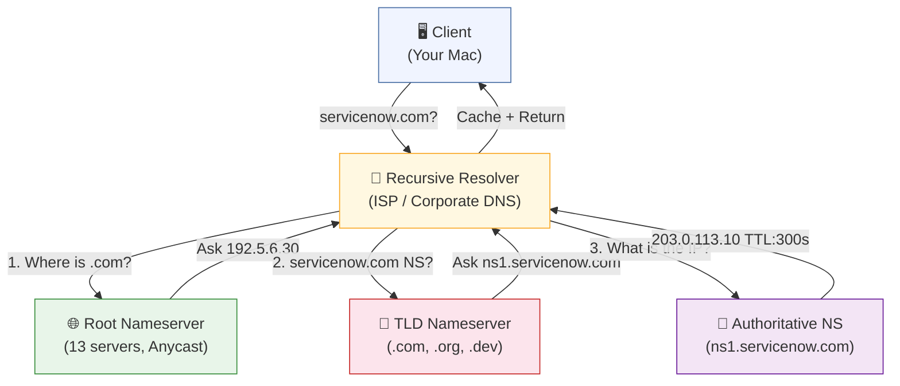

**Root Nameservers (Level 0)** — Only 13 logical servers (A–M), but each is replicated to 1000+ physical locations via Anycast. They only answer one question: "Which server handles this TLD?" Query volume is ~100M/day, but that's a tiny fraction of total DNS traffic because everything gets cached.

**TLD Nameservers (Level 1)** — Operated by registries like Verisign (.com). `.COM` alone has ~2,000 servers globally. They answer: "Which authoritative nameserver does `servicenow.com` use?"

**Authoritative Nameservers (Level 2)** — Owned and operated by each company. ServiceNow runs `ns1.servicenow.com`, `ns2`, etc. These are the source of truth — they hold the actual IP-to-domain mappings, and companies can update them instantly.

**Recursive Resolvers (Level 3)** — This is the layer I interact with most often. Google's `8.8.8.8`, Cloudflare's `1.1.1.1`, or at an enterprise the internal corporate resolver. These take my query, walk the hierarchy, get the answer, and cache it for everyone on the same network.

---

## Walking a Real Query: servicenow.com

Let me trace exactly what happens — first in the fast path (cache hit), then in the full recursive path.

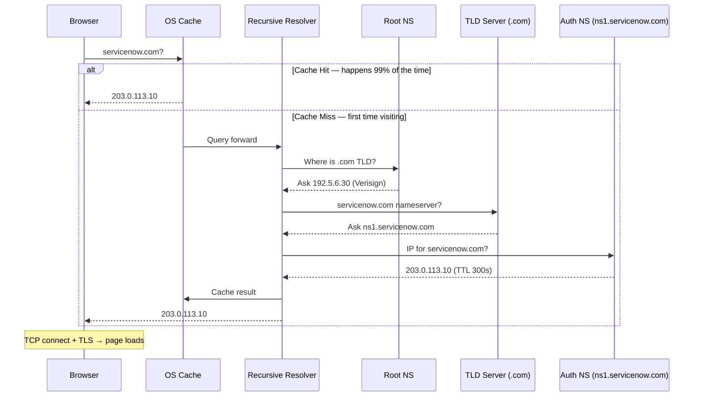

### Timing

```
CACHE HIT (99% of queries):
  Browser cache hit:    <1ms
  OS cache hit:         <5ms
  Resolver cache hit:   5-15ms

FULL RECURSIVE (1% of queries):
  Query root:           +10ms
  Query TLD:            +10ms
  Query auth:           +10ms
  Return to client:     +5ms
  ─────────────────────────────
  Total DNS:            ~50ms
  + TLS handshake:      ~50ms
  ─────────────────────────────
  User perception:      ~100ms — still feels instant
```

---

## Why Caching is the Real Secret

When I first thought about DNS performance, I assumed the speed came from fast hardware. It doesn't. It comes from caching — 99% of queries never leave your local machine or resolver.

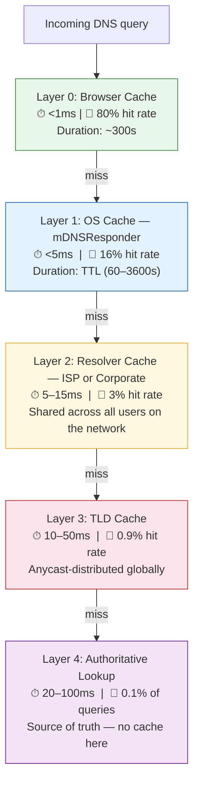

What makes the resolver cache especially powerful is that it's **shared**. In my office, if 10,000 employees all visit `example.com`, only the very first query hits that site's nameservers. The other 9,999 are served from the corporate resolver's cache. One lookup serves an entire organization.

```
10,000 employees query example.com today:
├─ Query 1:      Full recursive → 50ms → cached
└─ Query 2-10000: Resolver cache hit → 5ms each

Savings: 9,999 recursive lookups avoided
```

---

## Anycast: How 13 Servers Serve the World

One thing that surprised me when I looked into this: there are only 13 root nameserver IP addresses. Yet a root query from Sydney responds in ~10ms, and so does one from London or Tokyo.

The answer is **Anycast** — the same IP address is simultaneously announced from thousands of geographic locations via BGP. Your query gets routed to the nearest physical server, not some fixed datacenter on the other side of the world.

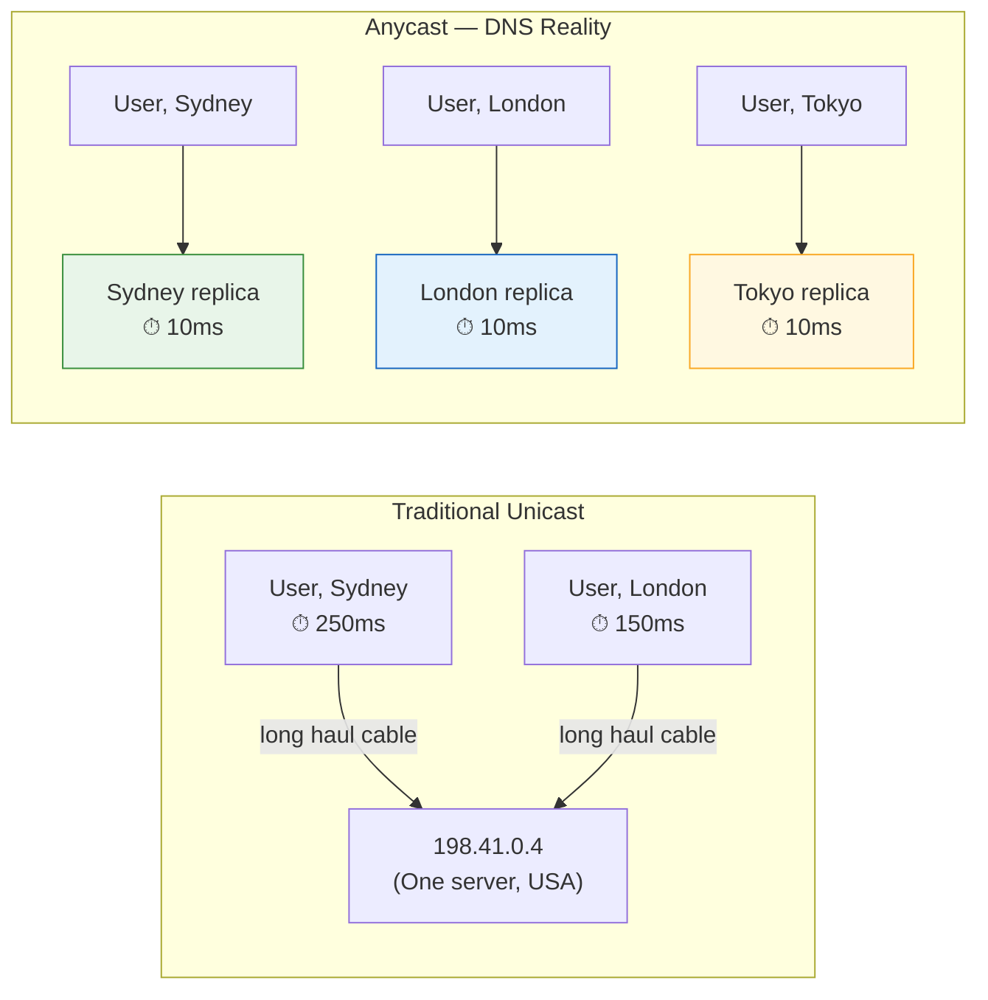

Root server "A" (`198.41.0.4`) has 1000+ physical replicas worldwide. BGP routing sends your query to the nearest one automatically. If that location goes down, BGP reroutes to the next nearest — zero configuration needed.

---

## Performance Optimizations at the Resolver

Beyond caching, recursive resolvers use a few clever techniques to squeeze out more performance:

**Query Pipelining** — Instead of querying Root → wait → TLD → wait → Auth in sequence, resolvers pipeline or parallelize where possible. What would take 30ms sequentially completes in ~10ms.

**Connection Pooling** — Resolvers maintain persistent TCP connections to root, TLD, and auth servers. No TCP handshake overhead per query. Saves 5–15ms per lookup.

**Negative Caching** — If a domain doesn't exist (`NXDOMAIN`), that result is cached too (typically TTL 300s). So mistyped domains don't hammer nameservers repeatedly.

---

## The Scale Picture

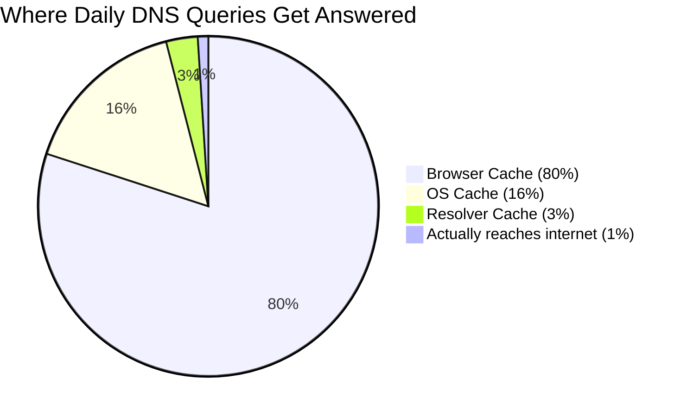

| Layer | Servers | Queries/day | Peak QPS |
|---|---|---|---|
| Root nameservers | 13 logical / 1000+ physical | ~100M | 1,000+/server |
| .COM TLD servers | ~2,000 | ~1B | 100K+ |
| Recursive resolvers | Many (ISP/cloud) | Billions | 10K–100K |
| Your machine | 1 | ~500 | <1ms |

---

## A Thought Experiment: A Startup Goes Viral

This is the case that really made DNS click for me. Imagine a new startup domain launches and gets unexpectedly shared everywhere. What does DNS do?

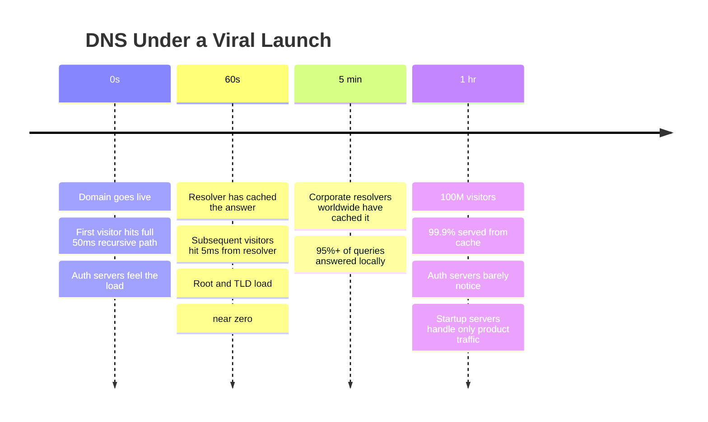

DNS silently absorbs the traffic spike through caching. The startup's infrastructure never gets hammered with DNS load — only product traffic reaches their servers. This is one of the more elegant self-regulating behaviors I've seen in any distributed system.

---

## What I Saw On My Own Machine

When I looked at my actual DNS config at work, the setup followed a typical enterprise pattern:

```
Primary resolver:   10.x.0.1   (corporate internal DNS)
Secondary:          10.x.0.2
Tertiary:           10.x.0.3

Search domains:     corp.example-company.com
                    example-company.com

Test resolution:    internal.example-company.com → 10.x.1.3  (internal IP!)
```

All three resolvers are internal — sitting behind a corporate security proxy. Every DNS query goes through it before it can reach the public internet. That means queries are filtered, logged, and checked against security policies before resolution.

This setup has an interesting security implication: the Tanium endpoint agent can observe DNS queries at the OS level. Security teams use this to detect malware — a compromised machine often beacons out to a command-and-control server, and the DNS query to that domain is visible before any actual data is exfiltrated. DNS logs are one of the earliest signals in incident detection.

---

## Modern Challenges Worth Knowing

**DNS over HTTPS (DoH)** — Plain DNS is unencrypted. Anyone on the network path (including your corporate proxy) can see every domain you query. DoH wraps DNS in HTTPS, hiding queries from network observers. The trade-off is a few milliseconds of TLS overhead per uncached query, and it shifts trust from your ISP to your DoH provider.

**DNSSEC** — Without it, nothing stops a network attacker from intercepting a DNS response and substituting a malicious IP (cache poisoning). DNSSEC adds cryptographic signatures to responses. Clients verify the signature before trusting the answer. Overhead is ~5–10ms for validation.

**DNS Amplification Attacks** — A 50-byte DNS query can trigger a 3,000-byte response. Attackers spoof the source IP to a victim's address, and the victim gets flooded with amplified traffic. Defense is rate limiting and filtering spoofed-source packets (BCP38).

---

## DNS Record Types: The Complete Reference

Understanding DNS record types is table stakes for architects. Here's every record type that matters, with the context that textbooks usually skip.

### Quick Reference

| Record | Maps | Primary Use |
|---|---|---|
| **A** | Domain → IPv4 | Basic hostname resolution |
| **AAAA** | Domain → IPv6 | IPv6 hostname resolution |
| **CNAME** | Domain → Domain | Aliases, CDN, load balancers (e.g., setting up a custom domain for GitHub Pages) |
| **MX** | Domain → Mail server | Email routing with priority |
| **TXT** | Domain → Text | SPF, DKIM, DMARC, ownership proofs |
| **NS** | Domain → Nameserver | Subdomain delegation |
| **SOA** | Zone metadata | Serial numbers, refresh timers |
| **PTR** | IP → Domain | Reverse lookup, email deliverability |
| **SRV** | Service + port | Kubernetes, Consul, service discovery |
| **CAA** | Allowed cert authorities | Prevent rogue TLS cert issuance |
| **ALIAS/ANAME** | Apex domain → Domain | CDN at root domain |
| **HTTPS** | HTTPS hints + ALPN | Skip redirects, advertise HTTP/3 |

---

### A / AAAA — The Foundation

```
A record:
servicenow.com.    300    IN    A       203.0.113.10

AAAA record:
servicenow.com.    300    IN    AAAA    2001:db8::1
```

Nothing surprising here — these are the records everything else builds on. The TTL (`300` seconds) is the key architectural lever I'll return to in the patterns section.

---

### CNAME — Aliases and the Apex Problem

CNAME maps one name to another. The resolver follows the chain until it reaches an A/AAAA record.

```
www.servicenow.com.    300    IN    CNAME    servicenow.com.
servicenow.com.        300    IN    A        203.0.113.10
```

**The CNAME at apex problem is one of the most common DNS gotchas.**

RFC 1912 forbids CNAME at the zone apex (`servicenow.com` itself) because the apex must host SOA and NS records, and a CNAME cannot coexist with any other record type. This breaks CDN setups where you want the root domain pointing to a CDN edge hostname.

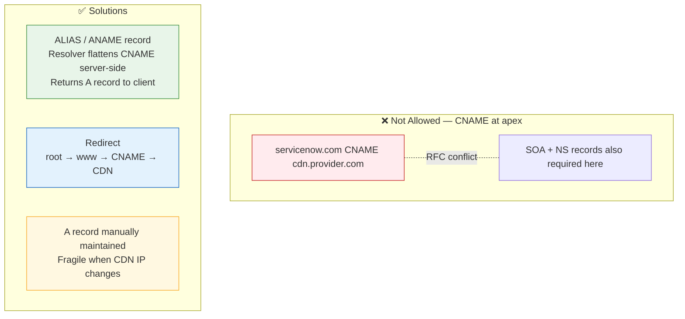

Cloudflare calls this **CNAME Flattening**, Route53 calls it **Alias records** — both resolve the CNAME server-side and serve a plain A record to the client.

**CNAME chains are a latency trap.** Each hop is a full extra DNS round-trip:

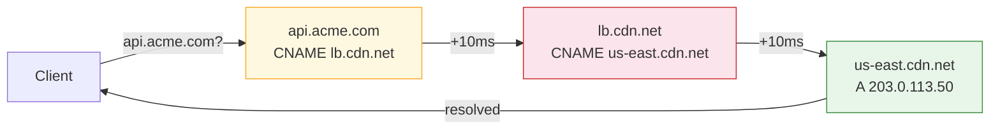

I've seen chains of 4–5 CNAMEs in production adding 150ms+ to first-byte time. Keep chains to one or two levels maximum.

---

### TXT — The Swiss Army Knife

TXT records carry arbitrary text. In practice they do three critical things:

**1. Email authentication (SPF / DKIM / DMARC)**

```
; SPF — which mail servers may send on behalf of this domain
acme.com.    TXT    "v=spf1 include:_spf.google.com ~all"

; DKIM — public key for verifying email signatures
selector._domainkey.acme.com.    TXT    "v=DKIM1; k=rsa; p=MIGfMA0..."

; DMARC — policy for emails that fail SPF/DKIM
_dmarc.acme.com.    TXT    "v=DMARC1; p=reject; rua=mailto:dmarc@acme.com"
```

If building any product that sends transactional email, SPF/DKIM/DMARC is non-negotiable. Misconfigured email auth is the single most common reason emails land in spam.

**2. Domain ownership verification**

Every cloud provider asks you to add a TXT record to prove domain ownership. Let's Encrypt uses the same pattern for DNS-01 ACME challenges (the only option for wildcard certs).

```
; AWS ACM certificate validation
_abc123.acme.com.    TXT    "_def456.acm-validations.aws."
```

**3. Zero-downtime cert issuance**

DNS-01 challenges let you issue and renew certs without serving a file over HTTP — essential for internal services with no public ingress.

---

### MX — Mail Routing

```
; Lower priority number = preferred
acme.com.    MX    10    mail1.acme.com.
acme.com.    MX    20    mail2.acme.com.
```

Sending servers query MX first, try lowest priority, fall back up the list on failure — automatic failover for email delivery with no client configuration.

---

### PTR — Reverse DNS

PTR records map IPs back to domain names. They live in the `in-addr.arpa` zone and are controlled by the IP owner (usually your ISP or cloud provider), not the domain owner.

```
; Forward
mail.acme.com.    A    203.0.113.25

; Reverse — in 113.0.203.in-addr.arpa zone
25.113.0.203.in-addr.arpa.    PTR    mail.acme.com.
```

**Why architects care:** Receiving mail servers do a PTR lookup on the sending IP. No PTR record (or a mismatch) → email rejected or spam-scored. Easy to miss when self-hosting email or using a dedicated IP — request PTR from your cloud provider before sending.

---

### SRV — Service Discovery

SRV records encode service name, protocol, priority, weight, port, and target hostname in one record. Format: `_service._proto.domain`

```
_http._tcp.my-svc.my-namespace.svc.cluster.local.    SRV    0 50 80 pod-0.my-svc.my-namespace.svc.cluster.local.
_http._tcp.my-svc.my-namespace.svc.cluster.local.    SRV    0 50 80 pod-1.my-svc.my-namespace.svc.cluster.local.
```

Kubernetes CoreDNS, Consul, and Nomad all use SRV records for service discovery. If building a service mesh or doing client-side load balancing, SRV records are how your service finds peers without hardcoding IPs or ports.

---

### CAA — Certificate Authority Authorization

CAA records specify which CAs may issue TLS certificates for your domain. CAs are required to check before issuance.

```
acme.com.    CAA    0 issue     "letsencrypt.org"
acme.com.    CAA    0 issue     "digicert.com"
acme.com.    CAA    0 issuewild "letsencrypt.org"
acme.com.    CAA    0 iodef     "mailto:security@acme.com"
```

Prevents a rogue CA from issuing a valid cert for your domain. Low effort, high value — still widely ignored.

---

## Architect Patterns: DNS in Production

Record types are vocabulary. These are the patterns that actually matter when designing systems.

### Pattern 1: TTL Reduction for Zero-Downtime Migrations

The most important DNS trick for migrations that nobody talks about enough.

If your A record has TTL=3600, clients cache the old IP for up to an hour after you change it. If something goes wrong, you're stuck waiting.

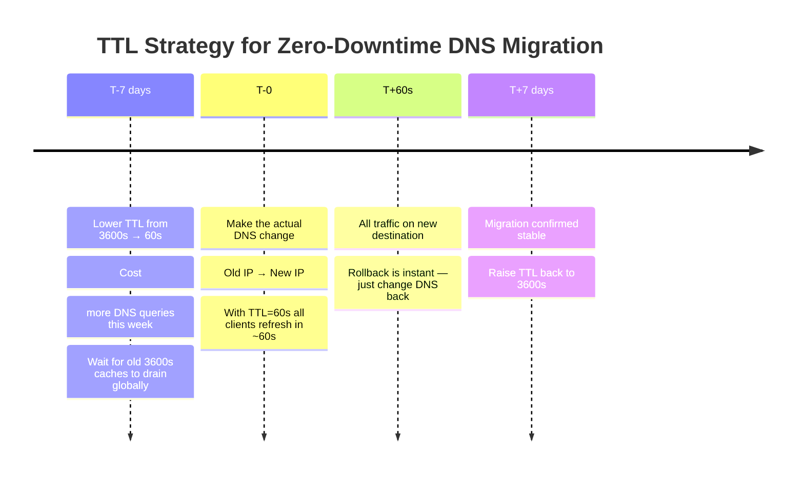

This sounds obvious but gets skipped constantly. I've seen migrations where TTL was 86400 (24 hours) and the team changed DNS mid-deploy, then spent a full day watching traffic slowly, unstoppably shift.

---

### Pattern 2: Blue/Green and Canary via DNS

DNS weighted routing lets you split traffic without touching application code.

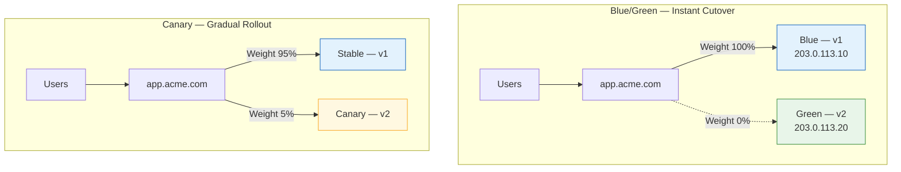

Route53, Cloudflare, and most modern DNS providers support weighted records natively. **Caveat:** DNS caching means traffic shift isn't instantaneous. With TTL=60s, full shift takes ~60s. For hard cutover requirements, combine with load balancer routing rules. Use DNS for region-level traffic control; load balancer for instance-level.

---

### Pattern 3: Split-Horizon DNS

Same domain, different IPs depending on where the query originates. Internal network gets internal IP; external internet gets public IP.

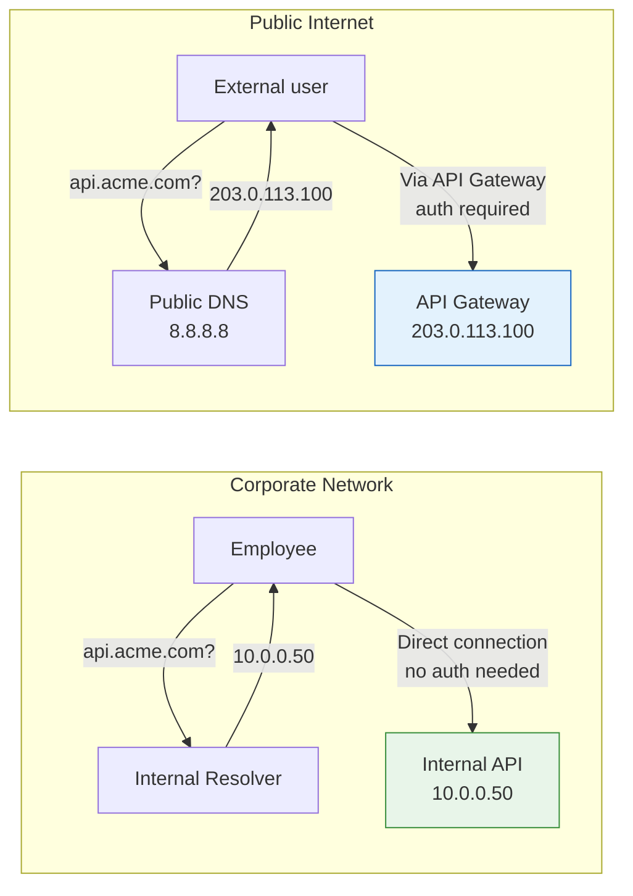

Internal resolver returns private IPs; public authoritative DNS returns public IPs. No client configuration needed — routing is entirely based on which resolver the client uses. This is how most enterprises serve the same hostname internally and externally without exposing private infrastructure.

---

### Pattern 4: Kubernetes Service Discovery via CoreDNS

Kubernetes runs CoreDNS for in-cluster DNS. Every Service gets an automatic DNS entry.

```
# Standard service DNS pattern
<service>.<namespace>.svc.cluster.local

# Regular service (single ClusterIP — load balanced by kube-proxy)
auth-service.platform.svc.cluster.local        → 10.96.0.10

# Headless service (no ClusterIP — returns individual pod IPs)
# Used for stateful workloads where you need pod-specific addressing
kafka-0.kafka.infra.svc.cluster.local          → 10.244.1.5
kafka-1.kafka.infra.svc.cluster.local          → 10.244.2.6
kafka-2.kafka.infra.svc.cluster.local          → 10.244.3.7
```

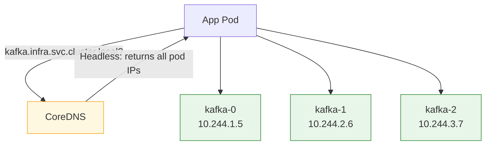

The search domain config (`svc.cluster.local`) lets services use short names. `curl auth-service` resolves to `auth-service.default.svc.cluster.local` automatically. Architects designing microservices on Kubernetes should bake this into service naming conventions and cross-namespace communication patterns.

---

### Pattern 5: DNS Failover with Health Checks

Route53 and Cloudflare attach health checks directly to DNS records. If the check fails, the record is removed from responses automatically.

```
Primary:   api.acme.com    A    203.0.113.10    (health check: GET /health every 30s)
Secondary: api.acme.com    A    203.0.113.20    (only served if primary fails health check)
```

DNS-level HA without a load balancer in the critical path. Trade-off: recovery window is TTL + health check interval (~30–90 seconds). For stricter RTO, combine with load balancer health checks — DNS handles region-level failover, load balancer handles instance-level.

---

### Gotchas Worth Knowing

**Stale cache during incidents** — Some resolvers cache past the TTL (Google's 8.8.8.8 has been observed caching up to 2× TTL). Build incident runbooks assuming this — don't change DNS and immediately test. Wait TTL + buffer, then verify.

**NS delegation TTL** — When delegating a subdomain to another provider, the NS record TTL is often overlooked. Setting it to 86400 and then switching providers means a 24-hour propagation window. Keep delegation TTLs lower if you expect to change them.

**Email without PTR fails silently** — Transactional email services handle PTR automatically. But a bare VM with a custom sending IP is easy to forget. Symptom: email delivered but lands in spam, takes days to diagnose.

**CNAME and MX cannot coexist** — If `mail.acme.com` is a CNAME, you cannot also have an MX record pointing to it. MX targets must resolve to A or AAAA records directly. Trips teams up when restructuring DNS for a new mail provider.

**DNS is not a load balancer** — Multiple A records for the same domain (round-robin DNS) looks like load balancing but isn't. Clients cache one IP and reuse it for the full TTL. Use DNS for routing traffic to regions or clusters; use a real load balancer within them.

---

## What Makes This Design Elegant

Looking back at what DNS gets right:

1. **Hierarchy solves scale** — each level handles only a fraction of total traffic, and the problem shrinks at every layer (sort of like sharding in DB)
2. **Caching absorbs spikes** — 99% answered locally means viral events don't collapse the system
3. **Anycast collapses geography** — same IP, 1000+ locations, ~10ms anywhere on earth
4. **Stateless design** — no session state, linear scaling by adding replicas
5. **TTL as the consistency knob** — tune freshness vs performance per-domain
6. **Self-healing via BGP** — anycast failover requires zero manual intervention

DNS was designed in 1983 and still handles the modern internet better than most systems built in the last decade. It's one of those rare systems where the original design decisions aged beautifully — not because nothing changed, but because the core abstractions were right.

---


