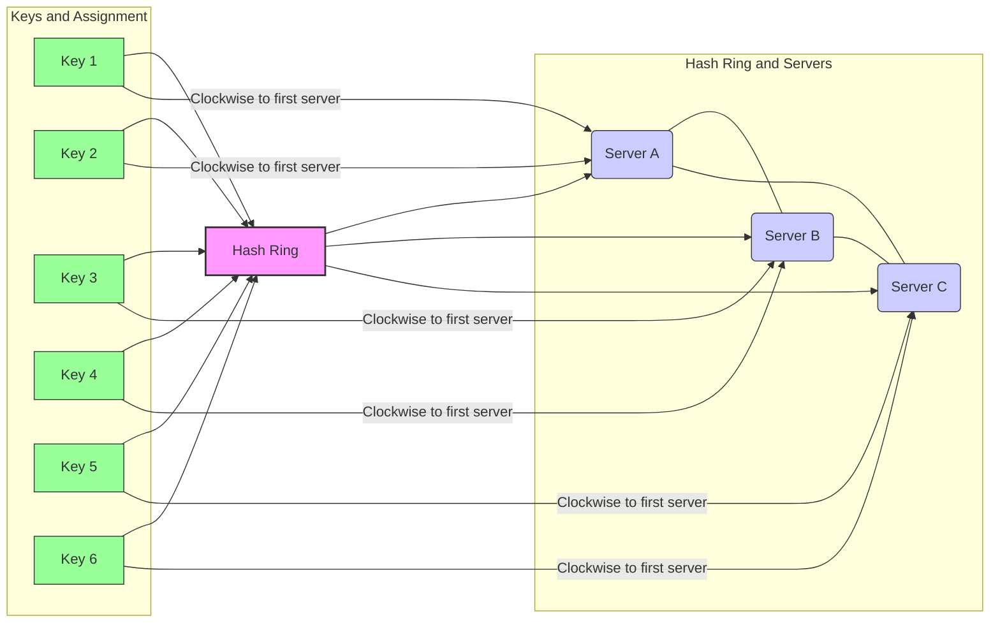

# Consistent Hashing
{: .no_toc }


---

```mermaid

graph LR
    A[Hash Ring] --> B(Server A);
    A --> C(Server B);
    A --> D(Server C);
    E[Key 1] --> A;
    F[Key 2] --> A;
    G[Key 3] --> A;
    H[Key 4] --> A;
    I[Key 5] --> A;
    J[Key 6] --> A;

    style A fill:#f9f,stroke:#333,stroke-width:2px;
    style B fill:#ccf,stroke:#333;
    style C fill:#ccf,stroke:#333;
    style D fill:#ccf,stroke:#333;
    style E fill:#9f9,stroke:#333;
    style F fill:#9f9,stroke:#333;
    style G fill:#9f9,stroke:#333;
    style H fill:#9f9,stroke:#333;
    style I fill:#9f9,stroke:#333;
    style J fill:#9f9,stroke:#333;

    subgraph "Hash Ring and Servers"
    B---C---D---B;
    end

    subgraph "Keys and Assignment"
    E-->|Clockwise to first server|B;
    F-->|Clockwise to first server|B;
    G-->|Clockwise to first server|C;
    H-->|Clockwise to first server|C;
    I-->|Clockwise to first server|D;
    J-->|Clockwise to first server|D;
    end
```

---



