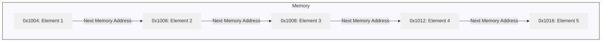

# Linear Data Structure: Array
{: .no_toc }


---

## Table of contents
{: .no_toc .text-delta }
1. TOC
{:toc}

--- 


Arrays are one of the most fundamental and widely used data structures in computer science. They provide a way to store and organize collections of data in a structured and efficient manner. In this blog post, we'll delve deep into the world of arrays, exploring their core concepts, practical applications, and some nuances that every programmer should be aware of.


# What is an Array?
At its core, an array is a collection of elements of the same data type, stored in contiguous memory locations. Think of it as a neatly arranged row of boxes, where each box can hold a value, and you can access any box directly by its position.




### Key Characteristics:  
- **Fixed Size:** Arrays have a fixed size, which means you need to specify the number of elements when you create the array. This size cannot be changed during the program's execution (for statically allocated arrays)
- **Contiguous Memory:** The elements of an array are stored in adjacent memory locations. This contiguous allocation is crucial for efficient access to array elements
- **Indexed Access:** Each element in an array is assigned a unique index. Indexing typically starts at 0, meaning the first element has an index of 0, the second element has an index of 1, and so on
- **Homogeneous Data:** Each element in an array is assigned a unique index. Indexing typically starts at 0, meaning the first element has an index of 0, the second element has an index of 1, and so on

---

# Why Use Arrays?
Arrays offer several advantages that make them a valuable data structure:
- **Efficient Access:** Because elements are stored contiguously, you can access any element in constant time, O(1), given its index. This is a significant advantage for applications that require fast data retrieval.
- **Simplicity:** Arrays provide a straightforward way to organize data, making them easy to understand and use.
- **Foundation for Other Data Structures:** Arrays serve as the building blocks for more complex data structures like matrices, strings, and hash tables.

---

# Operations
Let's explore the common operations you can perform on arrays:


### 1. Array Declaration

* **Syntax:**

    ```c++
    data_type array_name[array_size];
    ```

    * `data_type`: The type of data the array will hold (e.g., `int`, `float`, `char`).
    * `array_name`: The name you give to the array.
    * `array_size`: The number of elements the array can store (must be a constant expression for statically allocated arrays).

* **Examples:**

    ```c++
    int numbers[5];         // Declares an integer array of size 5
    float temperatures[10]; // Declares a float array of size 10
    char letters[26];       // Declares a character array of size 26
    ```

### 2. Array Initialization

* **Method 1: During Declaration**

    ```c++
    int numbers[5] = {10, 20, 30, 40, 50}; // Initialize with values
    ```

    * If you provide fewer initializers than the size, the remaining elements are value-initialized (usually to 0 for numeric types).

    ```c++
    int numbers[5] = {10, 20}; // numbers will be {10, 20, 0, 0, 0}
    ```

    * If you initialize all values, you can omit the array size (but it is bad practice):

    ```c++
    int numbers= {10, 20, 30, 40, 50}; // Size is automatically 5
    ```

* **Method 2: Element-by-Element**

    ```c++
    int numbers[5];
    numbers[0] = 10;
    numbers[1] = 20;
    numbers[2] = 30;
    numbers[3] = 40;
    numbers[4] = 50;
    ```

### 3. Accessing Array Elements

* Use the array name and the index of the element within square brackets ``.
* Array indices start at 0.

    ```c++
    int numbers[5] = {10, 20, 30, 40, 50};
    int firstElement = numbers[0]; // firstElement will be 10
    int thirdElement = numbers[2]; // thirdElement will be 30
    ```

### 4. Modifying Array Elements

* You can change the value of an element by assigning a new value to it using its index.

    ```c++
    int numbers[5] = {10, 20, 30, 40, 50};
    numbers[2] = 35; // Change the value at index 2 to 35
    // numbers is now {10, 20, 35, 40, 50}
    ```

### 5. Traversing Arrays

* **Using a `for` loop:** This is the most common way to iterate through all the elements of an array.

    ```c++
    int numbers[5] = {10, 20, 30, 40, 50};
    for (int i = 0; i < 5; ++i) {
        std::cout << numbers[i] << " "; // Print each element
    }
    std::cout << std::endl;
    ```

* **Using a Range-based `for` loop (C++11 and later):** This provides a simpler way to iterate through the array.

    ```c++
    int numbers[5] = {10, 20, 30, 40, 50};
    for (int number : numbers) {
        std::cout << number << " "; // Print each element
    }
    std::cout << std::endl;
    ```

# Array Size

* **Statically allocated arrays:** The size is fixed at compile time.
* C++ arrays do not have a built-in `length` property like some other languages.
* You often need to keep track of the size yourself, especially if you're passing arrays to functions.
* You can use `sizeof` to determine the size in bytes, but this is less useful for getting the number of elements.

    ```c++
    int numbers[5] = {10, 20, 30, 40, 50};
    int size = sizeof(numbers) / sizeof(numbers[0]); // Calculates the number of elements (5)
    ```

# Arrays and Pointers

* In C++, there's a strong relationship between arrays and pointers.
* The name of an array (without an index) often decays into a pointer to the first element of the array.

    ```c++
    int numbers[5] = {10, 20, 30, 40, 50};
    int* ptr = numbers; // ptr now points to numbers[0]
    std::cout << *ptr << std::endl; // Output: 10
    std::cout << numbers[0] << std::endl; // Output: 10
    ```

* You can use pointer arithmetic to access array elements.

    ```c++
    int numbers[5] = {10, 20, 30, 40, 50};
    int* ptr = numbers;
    std::cout << *(ptr + 2) << std::endl; // Output: 30 (same as numbers[2])
    ```

# Multidimensional Arrays

* C++ supports multidimensional arrays (arrays of arrays).
* **2D Array (Matrix):**

    ```c++
    int matrix[3][3] = {
        {1, 2, 3},
        {4, 5, 6},
        {7, 8, 9}
    };

    std::cout << matrix[1][2] << std::endl; // Output: 6
    ```

* **Traversing a 2D Array:**

    ```c++
    for (int i = 0; i < 3; ++i) {
        for (int j = 0; j < 3; ++j) {
            std::cout << matrix[i][j] << " ";
        }
        std::cout << std::endl;
    }
    ```

#  Dynamic Arrays

* C++ also allows you to create arrays whose size is determined at runtime using dynamic memory allocation with `new` and `delete`.
* One thing to note this array is created in heap memory rather then stack and if we dont deallocate the memory address after use, it could cause memory leak 

    ```c++
    int size;
    std::cout << "Enter the size of the array: ";
    std::cin >> size;

    int* dynamicArray = new int[size]; // Allocate memory for 'size' integers

    for (int i = 0; i < size; ++i) {
        dynamicArray[i] = i * 2;
    }

    for (int i = 0; i < size; ++i) {
        std::cout << dynamicArray[i] << " ";
    }
    std::cout << std::endl;

    deletedynamicArray; // Important: Deallocate dynamic memory
    ```

---

# Important Considerations

* **Array Bounds Checking:** C++ does *not* perform automatic bounds checking on arrays. If you access an element outside the valid index range (e.g., `numbers[10]` for an array of size 5), you'll get undefined behavior (crashes, corrupted data, etc.). It's the programmer's responsibility to ensure that array accesses are within bounds.
* **Fixed Size (for Statically Allocated):** Statically allocated arrays have a fixed size that's determined at compile time. If you need a collection that can grow or shrink, consider using `std::vector` (from the C++ Standard Template Library), which provides dynamic array-like functionality.

---

# Example: Complete C++ Program

```c++
#include <iostream>

int main() {
    // Statically allocated array
    int numbers[5] = {10, 20, 30, 40, 50};

    // Accessing and modifying
    std::cout << "Element at index 2: " << numbers[2] << std::endl;
    numbers[2] = 35;
    std::cout << "Modified element at index 2: " << numbers[2] << std::endl;

    // Traversing
    std::cout << "Array elements: ";
    for (int i = 0; i < 5; ++i) {
        std::cout << numbers[i] << " ";
    }
    std::cout << std::endl;

    // Dynamic array
    int size;
    std::cout << "Enter the size of the dynamic array: ";
    std::cin >> size;

    int* dynamicArray = new int[size];
    for (int i = 0; i < size; ++i) {
        dynamicArray[i] = i + 1;
    }

    std::cout << "Dynamic array elements: ";
    for (int i = 0; i < size; ++i) {
        std::cout << dynamicArray[i] << " ";
    }
    std::cout << std::endl;

    deletedynamicArray; // Important: Deallocate dynamic memory

    return 0;
}
```
---

