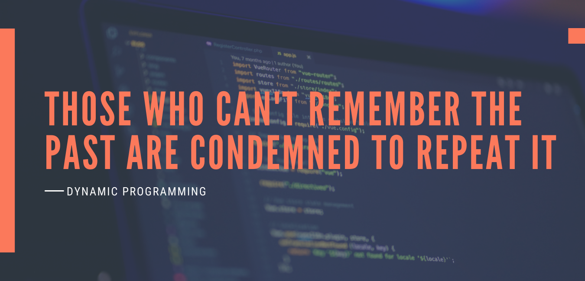

# How to Conquer Dynamic Programming
{: .no_toc }

---
## Table of contents
{: .no_toc .text-delta }
1. TOC
{:toc}
--- 


<br>


# How to Ace Dynamic Programming

If you're reading this blog, you likely have some basic knowledge of Dynamic Programming (DP). But if you don't, no worries! We'll start from the very basics and build up your understanding step by step.

Dynamic Programming can seem like a tough topic at first. The problems often appear complex and intimidating. However, the goal of this blog is to make these challenges feel more approachable and even fun!  

---

# What is Dynamic Programming?  

Dynamic Programming is a problem-solving technique that involves breaking a problem into smaller subproblems, solving each subproblem only once, and storing the results to avoid redundant calculations. It is an optimization over plain recursion that helps reduce time complexity from exponential to polynomial.  

Whenever you encounter a recursive solution with repeated calls for the same inputs, DP can optimize it significantly.  

## Two Approaches to Dynamic Programming:  

1. **Top-Down (Memoization):**  
   - This is a recursive approach where you store already computed values in a cache (array or hash table) to avoid redundant calculations.  
   - It starts from the main problem and breaks it down into subproblems.  

2. **Bottom-Up (Tabulation):**  
   - This approach solves the problem iteratively, building up the solution from the base cases.  
   - It starts from the smallest subproblems and works its way up to solve the main problem.  

---

# Understanding DP with Fibonacci Sequence

Let’s take a simple example to see how DP optimizes recursion.  

The Fibonacci sequence follows this recurrence relation:  

<div style="text-align: center">
[ F(n) = F(n-1) + F(n-2) ]
<br>
<br>
where ( F(0) = 0 ) and ( F(1) = 1 ).  
</div>


## Naive Recursive Approach (Exponential Time Complexity: O(2ⁿ))  

```cpp
int fib(int num) {
    if (num <= 1)
        return num;
    return fib(num - 1) + fib(num - 2);
}
```

This approach is highly inefficient due to repeated calculations

## Optimized DP Approach (Time Complexity: O(n))  


Using **Memoization** (Top-Down DP), we store previously computed results to avoid redundant calculations:  

```cpp
int fib(int num, vector<int>& dp) {
    if (dp[num] != -1)  
        return dp[num];  

    if (num <= 1)  
        return num;  

    // here we are storing the result for dp[n] before returning it to the caller
    // but when we call this recussively, its going to call every single smaller problem
    // will keep on storing the previously calculated result makeing sure, we dont duplicate our efforts
    return dp[num] = fib(num - 1, dp) + fib(num - 2, dp);
}
```

----

# When to Use Dynamic Programming?


You should consider DP when:

- You have choices to make in a problem (e.g., including or excluding an item in a knapsack).
- The problem asks for an optimal solution (e.g., finding the maximum or minimum value).
- The problem has overlapping subproblems (i.e., solving the same subproblem multiple times).

Some problems may also be solved using a greedy approach, but greedy methods sometimes fail to find the optimal solution, whereas DP guarantees correctness.

---

# Common DP Problems
Many DP problems are based on a few standard patterns. Some well-known DP problems include:

- Fibonacci Sequence
- 0/1 Knapsack Problem
- Unbounded Knapsack
- Longest Common Subsequence (LCS)
- Longest Increasing Subsequence (LIS)
- Matrix Chain Multiplication
- DP on Trees
- DP on Grids

These problem stetments are problem sovling pattern in itself and deserves topic dedicated for each of these topics but for this one lets just take one example and try to understand the fundamental concept, later we will explore all these propblems

---

# Converting Recursion to Dynamic Programming (Top-Down Approach)
To convert a recursive solution into a DP solution, follow these steps:

1. Identify the changing parameters in recursion.
    1. These will be stored in the DP table (array or matrix).
2. Define the base case explicitly.
    1. This will become the initialization step in DP.
3. Replace recursive calls with DP lookups.

Let’s take the 0/1 Knapsack Problem as an example:

<br>
**Problem Statement:**
> Given n items with weights and values, determine the maximum value that can be obtained in a knapsack of capacity W, where each item can either be included or excluded.


1. **Recursive Solution (Exponential Time Complexity: O(2ⁿ))**

```cpp
int knapsack(vector<int> wt, vector<int> val, int w, int n) {
    if (n == 0 || w == 0)  
        return 0;  

    if (wt[n-1] <= w) {  
        return max(  
            val[n-1] + knapsack(wt, val, w - wt[n-1], n-1),  
            knapsack(wt, val, w, n-1)  
        );  
    }  
    else {  
        return knapsack(wt, val, w, n-1);  
    }  
}
```

2. **Top-Down DP Solution (Time Complexity: O(n * W))**

```cpp
int knapsack_td(vector<int> wt, vector<int> val, int w, int n) {
    int dp[n + 1][w + 1];

    // Initialize base cases (0 items or 0 weight)
    for (int i = 0; i <= n; i++)  
        dp[i][0] = 0;
    for (int j = 0; j <= w; j++)  
        dp[0][j] = 0;

    // Fill DP table
    for (int i = 1; i <= n; i++) {
        for (int j = 1; j <= w; j++) {
            if (wt[i-1] <= j) {
                dp[i][j] = max(val[i-1] + dp[i-1][j-wt[i-1]], dp[i-1][j]);
            } else {
                dp[i][j] = dp[i-1][j];
            }
        }
    }

    return dp[n][w];
}
```

### Key Differences:
- In recursion, the function repeatedly recalculates values.
- In DP, we store results in a table and use them directly.
- The time complexity improves from `O(2ⁿ)` to `O(n * W)`.
- Just to give you some scale, switching from `O(2ⁿ)` to `O(n * W)` reduces execution time from 1,073 milliseconds (1 billion operations) to ~1.5 milliseconds (1,500 operations) for `n = 30, W = 50`, assuming a modern processor executes ~1 billion `(10⁹)` operations per second


---


# Final Thoughts and Next Steps

Most DP problems are variations of well-known problems. If you're struggling with a new DP problem, it's likely based on an existing one!

To master DP:

1. Solve classical DP problems. Start with Fibonacci, Knapsack, and LCS.
2. Recognize patterns. Most DP problems fit into standard templates.
3. Practice regularly. Try problems from sites like CSES, LeetCode, and Codeforces.

---

# Conclusion
Dynamic Programming may seem difficult at first, but with practice, it becomes a powerful tool for solving complex problems efficiently. By breaking problems into smaller subproblems, storing results, and avoiding redundant calculations, DP allows us to optimize many recursive solutions.

So, keep practicing, and soon you'll find DP problems much easier to tackle! 🚀

---

# Further Reading & Practice:

- CSES DP Problem Set: One of the best collections for DP practice.
- LeetCode DP Problems: Explore categorized DP problems.
- Codeforces Educational Rounds: Often feature DP-based problems.

---


